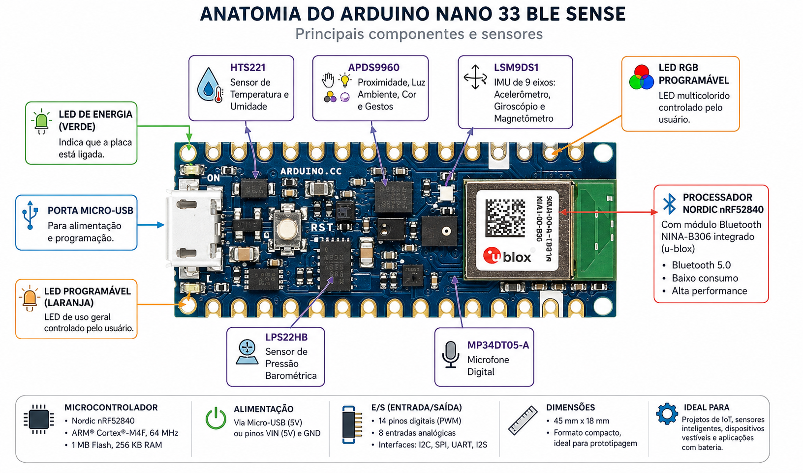

# Introdução a TinyML 
#### Professora: Rosana Rego.
Curso de Introdução a TinyML utilizando o Arduino Nano 33 BLE Sense. 
[Acesso o site](https://roscibely.github.io/tinyml/html/index.html)

## Hardware - Arduino Nano 33 BLE Sense
- Microcontrolador: ARM Cortex-M4F de 32 bits rodando a 64 MHz
- Memória Flash: 1 MB
- RAM: 256 KB
- Sensores: Acelerômetro, giroscópio, magnetômetro, sensor de temperatura, sensor de umidade, sensor de pressão, microfone
- Conectividade: Bluetooth Low Energy (BLE)
- Alimentação: 3.3V, consumo de energia muito baixo, ideal para projetos de IoT e TinyML. 

